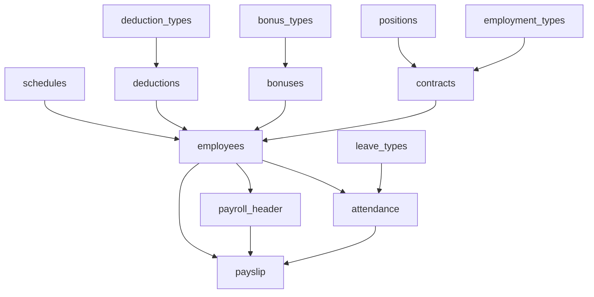

# 🔄 Payroll-Attendance Integration Guide

This document explains how the attendance system connects to the payroll system in the HRMS, including data flow, calculations, and processing workflows.

## 📊 System Overview

The HRMS integrates attendance tracking with payroll processing through a comprehensive data pipeline that:

- Captures attendance data with boolean flags
- Calculates work hours and overtime automatically
- Processes leave and holiday payments
- Generates payroll records with accurate deductions

## 🏗️ Database Architecture

### Core Tables Relationship



### Employee & Contract Structure

```sql
-- Employee Table (Core entity)
CREATE TABLE employees (
  employee_id VARCHAR(50) NOT NULL PRIMARY KEY,
  system_id SERIAL NOT NULL,
  contract_id INTEGER NULL REFERENCES contracts(contract_id),
  first_name VARCHAR(100) NOT NULL,
  last_name VARCHAR(100) NOT NULL,
  middle_name TEXT NULL,
  nickname TEXT NULL,
  suffix TEXT NULL,
  email VARCHAR(100) NOT NULL UNIQUE,
  date_of_birth DATE NULL,
  sex TEXT NULL,
  civil_status civil_status_type NOT NULL DEFAULT 'single',
  religion TEXT NULL,
  citizenship TEXT NULL,
  current_address TEXT NULL,
  permanent_address TEXT NULL,
  phone TEXT NULL,
  telephone TEXT NULL,
  avatar_url TEXT NULL UNIQUE,
  government_id_numbers_id BIGINT NULL UNIQUE REFERENCES government_id_numbers(government_id_numbers_id),
  schedule_id BIGINT NULL REFERENCES schedules(schedule_id) ON DELETE SET NULL,
  status employee_status NOT NULL DEFAULT 'active',
  created_at TIMESTAMP DEFAULT NOW(),
  updated_at TIMESTAMP DEFAULT NOW()
);

-- Contract Table (Rate & Employment Information)
CREATE TABLE contracts (
  contract_id SERIAL PRIMARY KEY,
  start_date DATE NOT NULL,
  end_date DATE NULL,
  rate NUMERIC(10, 2) NOT NULL,
  rate_type rate_type NOT NULL,
  position_id INTEGER NOT NULL REFERENCES positions(position_id),
  employment_type_id INTEGER NOT NULL REFERENCES employment_types(employment_type_id),
  created_at TIMESTAMP DEFAULT NOW(),
  updated_at TIMESTAMP DEFAULT NOW()
);
```

### Attendance Table Structure

```sql
CREATE TABLE attendance (
  attendance_id SERIAL PRIMARY KEY,
  employee_id VARCHAR(50) NOT NULL REFERENCES employees(employee_id),
  date DATE NOT NULL DEFAULT NOW(),
  time_in TIMESTAMP WITHOUT TIME ZONE NOT NULL,
  time_out TIMESTAMP WITHOUT TIME ZONE NULL,
  total_hours NUMERIC(5, 2) NULL,
  overtime_hours NUMERIC(5, 2) NULL DEFAULT 0,
  notes TEXT NULL,

  -- Attendance Status Flags
  is_present BOOLEAN NULL DEFAULT false,
  is_late BOOLEAN NULL DEFAULT false,
  is_absent BOOLEAN NULL DEFAULT false,
  is_undertime BOOLEAN NULL DEFAULT false,
  is_halfday BOOLEAN NULL DEFAULT false,

  -- Leave Status Flags
  on_leave BOOLEAN NULL DEFAULT false,
  leave_type_id INTEGER NULL REFERENCES leave_types(leave_type_id),
  leave_request_id INTEGER NULL REFERENCES leave_requests(leave_request_id),

  -- Holiday Status Flags
  is_dayoff BOOLEAN NULL DEFAULT false,
  is_regular_holiday BOOLEAN NULL DEFAULT false,
  is_special_holiday BOOLEAN NULL DEFAULT false,

  created_at TIMESTAMP WITHOUT TIME ZONE NULL DEFAULT NOW(),
  updated_at TIMESTAMP WITHOUT TIME ZONE NULL DEFAULT NOW(),

  -- Constraints
  CONSTRAINT attendance_employee_date_unique UNIQUE (employee_id, date)
);

-- Performance Index for Payroll Calculations
CREATE INDEX idx_attendance_payroll_flags ON attendance
USING btree (is_dayoff, is_regular_holiday, is_special_holiday);
```

### Payroll Tables Structure

```sql
-- Payroll Header (Pay Period Information)
CREATE TABLE payroll_header (
  payroll_header_id SERIAL PRIMARY KEY,
  run_date DATE NOT NULL,
  start_date DATE NOT NULL,
  end_date DATE NOT NULL,
  created_at TIMESTAMP WITHOUT TIME ZONE NULL DEFAULT NOW(),
  updated_at TIMESTAMP WITHOUT TIME ZONE NULL DEFAULT NOW()
);

-- Individual Employee Payslips
CREATE TABLE payslip (
  payslip_id SERIAL PRIMARY KEY,
  employee_id VARCHAR(50) NOT NULL REFERENCES employees(employee_id),
  payroll_header_id INTEGER NOT NULL REFERENCES payroll_header(payroll_header_id),
  gross_pay NUMERIC(10, 2) NOT NULL,
  overtime_pay NUMERIC(10, 2) NULL DEFAULT 0,
  night_diff_pay NUMERIC(10, 2) NULL DEFAULT 0,
  leave_pay NUMERIC(10, 2) NULL DEFAULT 0,
  bonuses NUMERIC(10, 2) NULL DEFAULT 0,
  deductions NUMERIC(10, 2) NULL DEFAULT 0,
  net_pay NUMERIC(10, 2) NOT NULL,
  created_at TIMESTAMP WITHOUT TIME ZONE NULL DEFAULT NOW(),
  updated_at TIMESTAMP WITHOUT TIME ZONE NULL DEFAULT NOW()
);
```

### Bonus & Deduction Tables Structure

````sql
-- Bonus Types
CREATE TABLE bonus_types (
  bonus_type_id SERIAL PRIMARY KEY,
  name VARCHAR(100) NOT NULL UNIQUE,
  description TEXT NULL,
  created_at TIMESTAMP WITHOUT TIME ZONE NULL DEFAULT NOW(),
  updated_at TIMESTAMP WITHOUT TIME ZONE NULL DEFAULT NOW()
);

-- Employee Bonuses
CREATE TABLE bonuses (
  bonus_id SERIAL PRIMARY KEY,
  employee_id VARCHAR(50) NOT NULL REFERENCES employees(employee_id),
  bonus_type_id INTEGER NOT NULL REFERENCES bonus_types(bonus_type_id),
  amount NUMERIC(10, 2) NOT NULL,
  description TEXT NULL,
  date DATE NOT NULL DEFAULT NOW(),
  created_at TIMESTAMP WITHOUT TIME ZONE NULL DEFAULT NOW(),
  updated_at TIMESTAMP WITHOUT TIME ZONE NULL DEFAULT NOW()
);

-- Deduction Types
CREATE TABLE deduction_types (
  deduction_type_id SERIAL PRIMARY KEY,
  name VARCHAR(100) NOT NULL UNIQUE,
  description TEXT NULL,
  created_at TIMESTAMP WITHOUT TIME ZONE NULL DEFAULT NOW(),
  updated_at TIMESTAMP WITHOUT TIME ZONE NULL DEFAULT NOW()
);

-- Employee Deductions
CREATE TABLE deductions (
  deduction_id SERIAL PRIMARY KEY,
  employee_id VARCHAR(50) NOT NULL REFERENCES employees(employee_id),
  deduction_type_id INTEGER NOT NULL REFERENCES deduction_types(deduction_type_id),
  amount NUMERIC(10, 2) NOT NULL,
  description TEXT NULL,
  date DATE NOT NULL DEFAULT NOW(),
  created_at TIMESTAMP WITHOUT TIME ZONE NULL DEFAULT NOW(),
  updated_at TIMESTAMP WITHOUT TIME ZONE NULL DEFAULT NOW()
);

-- Employment Types
CREATE TABLE employment_types (
  employment_type_id SERIAL PRIMARY KEY,
  name VARCHAR(100) NOT NULL UNIQUE,
  created_at TIMESTAMP WITHOUT TIME ZONE NULL DEFAULT NOW(),
  updated_at TIMESTAMP WITHOUT TIME ZONE NULL DEFAULT NOW()
);
```## 🔄 Data Flow: Attendance → Payroll

### 1. Attendance Data Collection

The system captures attendance with comprehensive boolean flags:

```javascript
// Clock-in Process
const result = await pool.query(
  `INSERT INTO attendance (
    employee_id, date, time_in, is_present, is_late, is_absent,
    is_dayoff, is_regular_holiday, is_special_holiday
  ) VALUES ($1, $2, $3, $4, $5, $6, $7, $8, $9)`,
  [
    employeeId,
    today,
    currentTime,
    true, // is_present = true
    isLate, // calculated based on schedule
    false, // is_absent = false (since clocking in)
    isScheduledDayOff, // working on scheduled day off
    holidayStatus.isRegularHoliday, // regular holiday flag
    holidayStatus.isSpecialHoliday, // special holiday flag
  ]
);
````

### 2. Payroll Calculation Process

The `calculateEmployeePayroll` function in `payrollController.js` integrates attendance data with contract information:

```javascript
// Employee Contract & Rate Query
const employeeData = await pool.query(
  `
  SELECT 
    e.employee_id, e.first_name, e.last_name,
    c.rate, c.rate_type, c.start_date, c.end_date,
    et.name as employment_type,
    p.title as position_title
  FROM employees e
  LEFT JOIN contracts c ON e.contract_id = c.contract_id
  LEFT JOIN employment_types et ON c.employment_type_id = et.employment_type_id
  LEFT JOIN positions p ON c.position_id = p.position_id
  WHERE e.employee_id = $1 AND e.status = 'active'
`,
  [employeeId]
);

// Attendance Data Query for Payroll
const attendanceData = await pool.query(
  `
  SELECT 
    COUNT(*) as days_worked,
    SUM(CASE WHEN on_leave = true AND leave_type_id IN (
      SELECT leave_type_id FROM leave_types WHERE name ILIKE '%paid%'
    ) THEN 1 ELSE 0 END) as paid_leave_days,
    SUM(COALESCE(total_hours, 0)) as total_hours,
    SUM(COALESCE(overtime_hours, 0)) as overtime_hours,
    COUNT(CASE WHEN is_late = true THEN 1 END) as late_days,
    COUNT(CASE WHEN is_dayoff = true AND is_present = true THEN 1 END) as dayoff_worked,
    COUNT(CASE WHEN is_regular_holiday = true AND is_present = true THEN 1 END) as regular_holiday_worked,
    COUNT(CASE WHEN is_special_holiday = true AND is_present = true THEN 1 END) as special_holiday_worked
  FROM attendance 
  WHERE employee_id = $1 
    AND date BETWEEN $2 AND $3
    AND (is_present = true OR on_leave = true)
`,
  [employeeId, startDate, endDate]
);
```

### 3. Rate Calculation Logic

The system supports three rate types based on the contract's `rate_type` field:

#### Hourly Rate Employees

```javascript
if (contract.rate_type === "hourly") {
  const regularHours = Math.min(
    attendanceData.total_hours,
    expectedHoursPerPeriod
  );
  const overtimeHours = Math.max(
    0,
    attendanceData.total_hours - expectedHoursPerPeriod
  );

  grossPay = regularHours * contract.rate + overtimeHours * contract.rate * 1.5;
}
```

#### Daily Rate Employees

```javascript
if (contract.rate_type === "daily") {
  const regularDays = Math.min(
    attendanceData.days_worked,
    expectedDaysPerPeriod
  );
  const overtimeDays = Math.max(
    0,
    attendanceData.days_worked - expectedDaysPerPeriod
  );

  grossPay = regularDays * contract.rate + overtimeDays * contract.rate * 1.5;
}
```

#### Monthly Salary Employees

```javascript
if (contract.rate_type === "monthly") {
  const expectedDays = calculateExpectedWorkingDays(startDate, endDate);
  grossPay = (attendanceData.days_worked / expectedDays) * contract.rate;
}
```

### 4. Bonus & Deduction Integration

The system integrates individual bonuses and deductions from their respective tables:

```javascript
// Get Employee Bonuses for Period
const bonusData = await pool.query(
  `
  SELECT 
    bt.name as bonus_type,
    SUM(b.amount) as total_bonus
  FROM bonuses b
  JOIN bonus_types bt ON b.bonus_type_id = bt.bonus_type_id
  WHERE b.employee_id = $1 
    AND b.date BETWEEN $2 AND $3
  GROUP BY bt.bonus_type_id, bt.name
`,
  [employeeId, startDate, endDate]
);

// Get Employee Deductions for Period
const deductionData = await pool.query(
  `
  SELECT 
    dt.name as deduction_type,
    SUM(d.amount) as total_deduction
  FROM deductions d
  JOIN deduction_types dt ON d.deduction_type_id = dt.deduction_type_id
  WHERE d.employee_id = $1 
    AND d.date BETWEEN $2 AND $3
  GROUP BY dt.deduction_type_id, dt.name
`,
  [employeeId, startDate, endDate]
);
```

## 🏖️ Leave Handling

### Paid Leave Processing

```javascript
// Paid Leave Calculation based on Contract Rate
const calculatePaidLeavePay = (contract, paidLeaveDays) => {
  switch (contract.rate_type) {
    case "daily":
      return paidLeaveDays * contract.rate;
    case "hourly":
      // Assuming 8 hours per day for hourly employees
      return paidLeaveDays * (contract.rate * 8);
    case "monthly":
      // Assuming 22 working days per month
      return paidLeaveDays * (contract.rate / 22);
    default:
      return 0;
  }
};

const paidLeavePay = calculatePaidLeavePay(
  contract,
  attendanceData.paid_leave_days
);
```

### Leave Types Integration

The system differentiates between paid and unpaid leave:

```sql
-- Paid leave is included in payroll calculations
SELECT leave_type_id FROM leave_types WHERE name ILIKE '%paid%'

-- Common paid leave types:
-- 'Paid Vacation Leave'
-- 'Paid Sick Leave'
-- 'Paid Emergency Leave'
-- 'Maternity/Paternity Leave' (paid)
```

## 🎉 Holiday Processing

### Holiday Pay Calculation

```javascript
// Holiday Pay Logic based on Contract Rate
const calculateHolidayPay = (contract, attendance) => {
  const dailyRate = getDailyRateFromContract(contract);

  if (attendance.is_regular_holiday && attendance.is_present) {
    // Regular holiday work = 200% of regular rate
    return dailyRate * 2.0;
  } else if (attendance.is_special_holiday && attendance.is_present) {
    // Special holiday work = 130% of regular rate
    return dailyRate * 1.3;
  } else if (attendance.is_regular_holiday && !attendance.is_present) {
    // Regular holiday not worked = 100% of regular rate (paid holiday)
    return dailyRate;
  }
  return 0;
};

const getDailyRateFromContract = (contract) => {
  switch (contract.rate_type) {
    case "daily":
      return contract.rate;
    case "hourly":
      return contract.rate * 8; // 8 hours per day
    case "monthly":
      return contract.rate / 22; // 22 working days per month
    default:
      return 0;
  }
};
```

### Day-off Premium

```javascript
// Working on scheduled day off
if (attendance.is_dayoff && attendance.is_present) {
  // Day-off work = 130% of regular rate
  const dailyRate = getDailyRateFromContract(contract);
  dayOffPremium = dailyRate * 0.3; // Additional 30%
}
```

## 💰 Deduction Management

### Government Mandatory Deductions

```javascript
// SSS Deduction Calculation
const sssDeduction = calculateSSSContribution(grossPay);

// PhilHealth Deduction
const philHealthDeduction = calculatePhilHealthContribution(grossPay);

// HDMF (Pag-IBIG) Deduction
const hdmfDeduction = calculateHDMFContribution(grossPay);

// Individual Employee Deductions (from deductions table)
const individualDeductions = deductionData.reduce((total, deduction) => {
  return total + parseFloat(deduction.total_deduction);
}, 0);

// Total Deductions
const totalDeductions =
  sssDeduction +
  philHealthDeduction +
  hdmfDeduction +
  individualDeductions +
  hdmfDeduction +
  lateDeductions +
  undertimeDeductions +
  lateDeductions +
  undertimeDeductions;
```

### Late and Undertime Deductions

```javascript
// Late Deduction Calculation based on Contract Rate
const calculateLateDeductions = (contract, lateDays) => {
  const dailyRate = getDailyRateFromContract(contract);
  return lateDays * (dailyRate * 0.1); // 10% penalty per late day
};

// Undertime Deduction (based on hours missed)
const calculateUndertimeDeductions = (contract, expectedHours, actualHours) => {
  const hourlyRate =
    contract.rate_type === "hourly"
      ? contract.rate
      : contract.rate_type === "daily"
      ? contract.rate / 8
      : contract.rate / 22 / 8; // monthly to hourly

  const undertimeHours = Math.max(0, expectedHours - actualHours);
  return undertimeHours * hourlyRate;
};

const lateDeductions = calculateLateDeductions(
  contract,
  attendanceData.late_days
);
const undertimeDeductions = calculateUndertimeDeductions(
  contract,
  expectedHours,
  attendanceData.total_hours
);
```

## 📋 Payroll Generation Workflow

### 1. Create Payroll Header

```javascript
const payrollHeader = await pool.query(
  `
  INSERT INTO payroll_header (run_date, start_date, end_date)
  VALUES ($1, $2, $3)
  RETURNING payroll_header_id
`,
  [runDate, startDate, endDate]
);
```

### 2. Process Each Employee

```javascript
// For each active employee with contracts
const employees = await pool.query(`
  SELECT e.*, c.rate, c.rate_type
  FROM employees e
  LEFT JOIN contracts c ON e.contract_id = c.contract_id
  WHERE e.status = 'active' AND c.contract_id IS NOT NULL
`);

for (const employee of employees.rows) {
  const payrollData = await calculateEmployeePayroll(
    employee.employee_id,
    startDate,
    endDate
  );

  await createPayslip(
    employee.employee_id,
    payrollHeader.payroll_header_id,
    payrollData
  );
}
```

### 3. Generate Payslip Records

```javascript
const createPayslip = async (employeeId, payrollHeaderId, payrollData) => {
  return await pool.query(
    `
    INSERT INTO payslip (
      employee_id, payroll_header_id, gross_pay, overtime_pay,
      night_diff_pay, leave_pay, bonuses, deductions, net_pay
    ) VALUES ($1, $2, $3, $4, $5, $6, $7, $8, $9)
    RETURNING payslip_id
  `,
    [
      employeeId,
      payrollHeaderId,
      payrollData.grossPay,
      payrollData.overtimePay,
      payrollData.nightDiffPay,
      payrollData.leavePay,
      payrollData.totalBonuses,
      payrollData.totalDeductions,
      payrollData.netPay,
    ]
  );
};
```

### 4. Bonus & Deduction Aggregation

```javascript
// Calculate total bonuses from bonuses table
const totalBonuses = bonusData.reduce((total, bonus) => {
  return total + parseFloat(bonus.total_bonus);
}, 0);

// Calculate total deductions from deductions table
const totalIndividualDeductions = deductionData.reduce((total, deduction) => {
  return total + parseFloat(deduction.total_deduction);
}, 0);

// Final net pay calculation
const netPay =
  grossPay + overtimePay + leavePay + totalBonuses - totalDeductions;
```

## 🔍 Key Integration Points

### 1. Database Relationships & Data Flow

| Source Table     | Target Table | Integration Point   | Purpose                                  |
| ---------------- | ------------ | ------------------- | ---------------------------------------- |
| `employees`      | `contracts`  | `contract_id`       | Rate and employment type information     |
| `employees`      | `attendance` | `employee_id`       | Daily attendance tracking                |
| `attendance`     | `payslip`    | Aggregated queries  | Calculate work hours, overtime, holidays |
| `bonuses`        | `payslip`    | Period aggregation  | Additional compensation                  |
| `deductions`     | `payslip`    | Period aggregation  | Individual deductions                    |
| `payroll_header` | `payslip`    | `payroll_header_id` | Pay period organization                  |

### 2. Attendance Flags → Payroll Components

| Attendance Flag             | Payroll Impact      | Calculation Method                     |
| --------------------------- | ------------------- | -------------------------------------- |
| `is_present = true`         | Regular pay         | `contract.rate` × based on `rate_type` |
| `overtime_hours > 0`        | Overtime pay        | 1.5× regular rate × overtime hours     |
| `on_leave = true` (paid)    | Leave pay           | Daily rate × paid leave days           |
| `is_regular_holiday = true` | Holiday pay         | 2× regular rate if worked, 1× if not   |
| `is_special_holiday = true` | Holiday premium     | 1.3× regular rate if worked            |
| `is_dayoff = true`          | Day-off premium     | 1.3× regular rate if worked            |
| `is_late = true`            | Late deduction      | 10% daily rate penalty per late day    |
| `is_undertime = true`       | Undertime deduction | Hourly rate × missed hours             |

### 3. Contract Rate Types & Calculations

| Rate Type | Base Calculation                                | Overtime Formula                       | Holiday Calculation                         |
| --------- | ----------------------------------------------- | -------------------------------------- | ------------------------------------------- |
| `hourly`  | `hours_worked × contract.rate`                  | `overtime_hours × contract.rate × 1.5` | `(contract.rate × 8) × holiday_multiplier`  |
| `daily`   | `days_worked × contract.rate`                   | `overtime_days × contract.rate × 1.5`  | `contract.rate × holiday_multiplier`        |
| `monthly` | `(days_worked / expected_days) × contract.rate` | Pro-rated overtime calculation         | `(contract.rate / 22) × holiday_multiplier` |

### 2. Data Validation

```javascript
// Ensure data integrity
if (attendanceData.days_worked === 0 && attendanceData.paid_leave_days === 0) {
  throw new Error("No valid attendance or paid leave records found");
}

if (grossPay < 0) {
  throw new Error("Gross pay cannot be negative");
}

if (netPay < 0) {
  console.warn("Net pay is negative - review deductions");
}
```

### 3. Audit Trail

```javascript
// Log payroll calculation details
const auditLog = {
  employee_id: employeeId,
  payroll_period: `${startDate} to ${endDate}`,
  days_worked: attendanceData.days_worked,
  total_hours: attendanceData.total_hours,
  overtime_hours: attendanceData.overtime_hours,
  gross_pay: grossPay,
  deductions: totalDeductions,
  net_pay: netPay,
  calculation_date: new Date(),
};
```

## 🚀 API Endpoints

### Payroll-Related Endpoints

```javascript
// Generate payroll for period
POST /api/payroll/generate
{
  "start_date": "2024-01-01",
  "end_date": "2024-01-15"
}

// Get employee payroll summary
GET /api/payroll/employee/:employee_id
?start_date=2024-01-01&end_date=2024-01-31

// Get payslip details
GET /api/payroll/payslip/:payslip_id
```

### Attendance Integration Endpoints

```javascript
// Get attendance summary for payroll
GET /api/attendance/payroll-summary/:employee_id
?start_date=2024-01-01&end_date=2024-01-31

// Bulk attendance processing
POST /api/attendance/bulk-upload
// Validates attendance data before payroll calculation
```

## 🔧 Configuration & Settings

### Rate Type Configurations

```javascript
const RATE_TYPES = {
  hourly: {
    calculation: "total_hours * contract.rate",
    overtime_multiplier: 1.5,
    holiday_multiplier: 2.0,
    daily_equivalent: "contract.rate * 8", // 8 hours per day
    leave_calculation: "contract.rate * 8", // 8 hours per leave day
  },
  daily: {
    calculation: "days_worked * contract.rate",
    overtime_multiplier: 1.5,
    holiday_multiplier: 2.0,
    hourly_equivalent: "contract.rate / 8", // 8 hours per day
    leave_calculation: "contract.rate", // 1 day rate per leave day
  },
  monthly: {
    calculation: "(days_worked / expected_days) * contract.rate",
    overtime_multiplier: 1.5,
    holiday_multiplier: 2.0,
    daily_equivalent: "contract.rate / 22", // 22 working days per month
    leave_calculation: "contract.rate / 22", // Daily rate for leave
  },
};
```

### Bonus & Deduction Types

```javascript
// Common bonus types from bonus_types table
const COMMON_BONUS_TYPES = [
  "Performance Bonus",
  "13th Month Pay",
  "Holiday Bonus",
  "Attendance Bonus",
  "Project Completion Bonus",
];

// Common deduction types from deduction_types table
const COMMON_DEDUCTION_TYPES = [
  "SSS Contribution",
  "PhilHealth Contribution",
  "HDMF/Pag-IBIG Contribution",
  "Income Tax",
  "Late Penalty",
  "Loan Deduction",
  "Uniform Deduction",
];
```

### Deduction Brackets

```javascript
const DEDUCTION_BRACKETS = {
  sss: [
    { min: 0, max: 3250, rate: 0.045 },
    { min: 3250, max: 5000, rate: 0.09 },
    // ... more brackets
  ],
  philhealth: [
    { min: 0, max: 10000, rate: 0.0275 },
    { min: 10000, max: 60000, rate: 0.03 },
    // ... more brackets
  ],
  hdmf: { flat_rate: 100 }, // ₱100 fixed
};
```

## 📊 Reporting & Analytics

### Payroll Summary Reports

```sql
-- Monthly payroll summary
SELECT
  ph.start_date,
  ph.end_date,
  COUNT(p.payslip_id) as total_employees,
  SUM(p.gross_pay) as total_gross,
  SUM(p.deductions) as total_deductions,
  SUM(p.net_pay) as total_net_pay
FROM payroll_header ph
JOIN payslip p ON ph.payroll_header_id = p.payroll_header_id
WHERE ph.start_date >= '2024-01-01'
GROUP BY ph.payroll_header_id, ph.start_date, ph.end_date;
```

### Attendance Impact Analysis

```sql
-- Comprehensive attendance impact on payroll with contract details
SELECT
  e.employee_id,
  e.first_name,
  e.last_name,
  c.rate,
  c.rate_type,
  et.name as employment_type,
  COUNT(CASE WHEN a.is_late = true THEN 1 END) as late_days,
  COUNT(CASE WHEN a.on_leave = true THEN 1 END) as leave_days,
  COUNT(CASE WHEN a.is_dayoff = true AND a.is_present = true THEN 1 END) as dayoff_worked,
  COUNT(CASE WHEN a.is_regular_holiday = true THEN 1 END) as regular_holidays,
  COUNT(CASE WHEN a.is_special_holiday = true THEN 1 END) as special_holidays,
  SUM(a.overtime_hours) as total_overtime,
  AVG(a.total_hours) as avg_daily_hours,
  p.gross_pay,
  p.overtime_pay,
  p.leave_pay,
  p.bonuses,
  p.deductions,
  p.net_pay
FROM employees e
LEFT JOIN contracts c ON e.contract_id = c.contract_id
LEFT JOIN employment_types et ON c.employment_type_id = et.employment_type_id
JOIN attendance a ON e.employee_id = a.employee_id
JOIN payslip p ON e.employee_id = p.employee_id
WHERE a.date BETWEEN '2024-01-01' AND '2024-01-31'
  AND e.status = 'active'
GROUP BY e.employee_id, e.first_name, e.last_name, c.rate, c.rate_type,
         et.name, p.gross_pay, p.overtime_pay, p.leave_pay, p.bonuses, p.deductions, p.net_pay;
```

### Bonus & Deduction Analysis

```sql
-- Individual bonus and deduction breakdown
SELECT
  e.employee_id,
  e.first_name,
  e.last_name,
  bt.name as bonus_type,
  SUM(b.amount) as total_bonus_amount,
  dt.name as deduction_type,
  SUM(d.amount) as total_deduction_amount
FROM employees e
LEFT JOIN bonuses b ON e.employee_id = b.employee_id
LEFT JOIN bonus_types bt ON b.bonus_type_id = bt.bonus_type_id
LEFT JOIN deductions d ON e.employee_id = d.employee_id
LEFT JOIN deduction_types dt ON d.deduction_type_id = dt.deduction_type_id
WHERE (b.date BETWEEN '2024-01-01' AND '2024-01-31')
   OR (d.date BETWEEN '2024-01-01' AND '2024-01-31')
GROUP BY e.employee_id, e.first_name, e.last_name, bt.name, dt.name
ORDER BY e.employee_id;
```

## ⚠️ Implementation Requirements & Missing Components

To implement this payroll-attendance integration flawlessly, the following components need to be addressed:

### 1. Configuration Management System

#### **Payroll Configuration Table**

```sql
CREATE TABLE payroll_config (
  config_id SERIAL PRIMARY KEY,
  config_key VARCHAR(100) NOT NULL UNIQUE,
  config_value VARCHAR(500) NOT NULL,
  data_type VARCHAR(20) NOT NULL CHECK (data_type IN ('integer', 'decimal', 'string', 'boolean')),
  description TEXT,
  is_active BOOLEAN DEFAULT true,
  created_at TIMESTAMP DEFAULT NOW(),
  updated_at TIMESTAMP DEFAULT NOW()
);

-- Insert default configurations
INSERT INTO payroll_config (config_key, config_value, data_type, description) VALUES
('monthly_working_days', '22', 'integer', 'Standard working days per month for monthly rate calculations'),
('standard_daily_hours', '8', 'integer', 'Standard working hours per day for rate conversions'),
('overtime_multiplier', '1.5', 'decimal', 'Overtime pay multiplier'),
('holiday_regular_multiplier', '2.0', 'decimal', 'Regular holiday pay multiplier'),
('holiday_special_multiplier', '1.3', 'decimal', 'Special holiday pay multiplier'),
('dayoff_multiplier', '1.3', 'decimal', 'Day-off work multiplier'),
('late_penalty_rate', '0.1', 'decimal', 'Late penalty as percentage of daily rate'),
('sss_employee_rate', '0.045', 'decimal', 'SSS employee contribution rate'),
('philhealth_employee_rate', '0.0275', 'decimal', 'PhilHealth employee contribution rate'),
('hdmf_monthly_contribution', '100', 'decimal', 'HDMF monthly contribution amount');
```

#### **Configuration Service Functions**

```javascript
// Configuration service for dynamic payroll settings
class PayrollConfigService {
  static async getConfig(key) {
    const result = await pool.query(
      "SELECT config_value, data_type FROM payroll_config WHERE config_key = $1 AND is_active = true",
      [key]
    );

    if (result.rows.length === 0) {
      throw new Error(`Configuration key '${key}' not found`);
    }

    const { config_value, data_type } = result.rows[0];

    switch (data_type) {
      case "integer":
        return parseInt(config_value);
      case "decimal":
        return parseFloat(config_value);
      case "boolean":
        return config_value.toLowerCase() === "true";
      default:
        return config_value;
    }
  }

  static async updateConfig(key, value) {
    await pool.query(
      "UPDATE payroll_config SET config_value = $1, updated_at = NOW() WHERE config_key = $2",
      [value.toString(), key]
    );
  }

  static async getMultipleConfigs(keys) {
    const result = await pool.query(
      "SELECT config_key, config_value, data_type FROM payroll_config WHERE config_key = ANY($1) AND is_active = true",
      [keys]
    );

    const configs = {};
    result.rows.forEach((row) => {
      const { config_key, config_value, data_type } = row;
      switch (data_type) {
        case "integer":
          configs[config_key] = parseInt(config_value);
          break;
        case "decimal":
          configs[config_key] = parseFloat(config_value);
          break;
        case "boolean":
          configs[config_key] = config_value.toLowerCase() === "true";
          break;
        default:
          configs[config_key] = config_value;
      }
    });

    return configs;
  }
}
```

### 2. Enhanced Rate Calculation Functions

#### **Dynamic Rate Calculation with Configurable Values**

```javascript
// Enhanced rate calculation with configurable working days and hours
const calculatePayrollWithConfig = async (employeeId, startDate, endDate) => {
  // Get configuration values
  const configs = await PayrollConfigService.getMultipleConfigs([
    "monthly_working_days",
    "standard_daily_hours",
    "overtime_multiplier",
    "holiday_regular_multiplier",
    "holiday_special_multiplier",
    "dayoff_multiplier",
    "late_penalty_rate",
  ]);

  // Get employee contract data
  const employeeData = await pool.query(
    `
    SELECT e.*, c.rate, c.rate_type, c.start_date, c.end_date,
           s.days_per_week, s.hours_per_day, s.break_duration
    FROM employees e
    LEFT JOIN contracts c ON e.contract_id = c.contract_id
    LEFT JOIN schedules s ON e.schedule_id = s.schedule_id
    WHERE e.employee_id = $1 AND e.status = 'active'
  `,
    [employeeId]
  );

  if (employeeData.rows.length === 0) {
    throw new Error("Employee not found or inactive");
  }

  const employee = employeeData.rows[0];
  const contract = employee;

  // Use schedule-specific hours if available, otherwise use config default
  const standardDailyHours =
    employee.hours_per_day || configs.standard_daily_hours;
  const monthlyWorkingDays = configs.monthly_working_days;

  return {
    employee,
    contract,
    standardDailyHours,
    monthlyWorkingDays,
    configs,
  };
};

// Enhanced daily rate conversion with configurable hours
const getDailyRateFromContract = (contract, standardDailyHours) => {
  switch (contract.rate_type) {
    case "daily":
      return contract.rate;
    case "hourly":
      return contract.rate * standardDailyHours;
    case "monthly":
      return contract.rate / configs.monthly_working_days;
    default:
      throw new Error(`Unsupported rate type: ${contract.rate_type}`);
  }
};

// Enhanced hourly rate conversion
const getHourlyRateFromContract = (
  contract,
  standardDailyHours,
  monthlyWorkingDays
) => {
  switch (contract.rate_type) {
    case "hourly":
      return contract.rate;
    case "daily":
      return contract.rate / standardDailyHours;
    case "monthly":
      return contract.rate / (monthlyWorkingDays * standardDailyHours);
    default:
      throw new Error(`Unsupported rate type: ${contract.rate_type}`);
  }
};
```

### 3. Schedule Integration Requirements

#### **Enhanced Schedule Table Structure**

```sql
-- Add configurable hours to schedule table if not exists
ALTER TABLE schedules ADD COLUMN IF NOT EXISTS hours_per_day NUMERIC(4,2) DEFAULT 8.00;
ALTER TABLE schedules ADD COLUMN IF NOT EXISTS days_per_week INTEGER DEFAULT 5;
ALTER TABLE schedules ADD COLUMN IF NOT EXISTS total_hours_per_week NUMERIC(5,2) GENERATED ALWAYS AS (hours_per_day * days_per_week) STORED;

-- Add employee-specific overrides table
CREATE TABLE IF NOT EXISTS employee_schedule_overrides (
  override_id SERIAL PRIMARY KEY,
  employee_id VARCHAR(50) NOT NULL REFERENCES employees(employee_id),
  override_type VARCHAR(50) NOT NULL CHECK (override_type IN ('hours_per_day', 'days_per_week', 'monthly_working_days')),
  override_value NUMERIC(10,2) NOT NULL,
  effective_from DATE NOT NULL DEFAULT NOW(),
  effective_until DATE NULL,
  reason TEXT,
  created_at TIMESTAMP DEFAULT NOW(),
  updated_at TIMESTAMP DEFAULT NOW()
);
```

### 4. Advanced Calculation Service

#### **Comprehensive Payroll Calculator**

```javascript
class AdvancedPayrollCalculator {
  constructor(configs) {
    this.configs = configs;
  }

  async calculateEmployeePayroll(employeeId, startDate, endDate) {
    // Get employee data with schedule overrides
    const employeeData = await this.getEmployeeWithOverrides(employeeId);
    const attendanceData = await this.getAttendanceData(
      employeeId,
      startDate,
      endDate
    );
    const bonusData = await this.getBonusData(employeeId, startDate, endDate);
    const deductionData = await this.getDeductionData(
      employeeId,
      startDate,
      endDate
    );

    // Calculate base pay with dynamic configurations
    const basePay = this.calculateBasePay(employeeData, attendanceData);
    const overtimePay = this.calculateOvertimePay(employeeData, attendanceData);
    const holidayPay = this.calculateHolidayPay(employeeData, attendanceData);
    const leavePay = this.calculateLeavePay(employeeData, attendanceData);

    // Calculate deductions
    const governmentDeductions = this.calculateGovernmentDeductions(
      basePay + overtimePay
    );
    const individualDeductions = this.sumIndividualDeductions(deductionData);
    const penaltyDeductions = this.calculatePenaltyDeductions(
      employeeData,
      attendanceData
    );

    // Calculate bonuses
    const totalBonuses = this.sumBonuses(bonusData);

    const grossPay = basePay + overtimePay + holidayPay + leavePay;
    const totalDeductions =
      governmentDeductions + individualDeductions + penaltyDeductions;
    const netPay = grossPay + totalBonuses - totalDeductions;

    return {
      grossPay,
      overtimePay,
      holidayPay,
      leavePay,
      totalBonuses,
      totalDeductions,
      netPay,
      breakdown: {
        basePay,
        governmentDeductions,
        individualDeductions,
        penaltyDeductions,
      },
    };
  }

  async getEmployeeWithOverrides(employeeId) {
    const result = await pool.query(
      `
      SELECT 
        e.*, c.rate, c.rate_type,
        s.hours_per_day as schedule_hours_per_day,
        s.days_per_week as schedule_days_per_week,
        COALESCE(
          (SELECT override_value FROM employee_schedule_overrides 
           WHERE employee_id = e.employee_id AND override_type = 'hours_per_day' 
           AND effective_from <= NOW() AND (effective_until IS NULL OR effective_until >= NOW())
           ORDER BY effective_from DESC LIMIT 1),
          s.hours_per_day,
          $2
        ) as effective_hours_per_day,
        COALESCE(
          (SELECT override_value FROM employee_schedule_overrides 
           WHERE employee_id = e.employee_id AND override_type = 'monthly_working_days'
           AND effective_from <= NOW() AND (effective_until IS NULL OR effective_until >= NOW())
           ORDER BY effective_from DESC LIMIT 1),
          $3
        ) as effective_monthly_working_days
      FROM employees e
      LEFT JOIN contracts c ON e.contract_id = c.contract_id
      LEFT JOIN schedules s ON e.schedule_id = s.schedule_id
      WHERE e.employee_id = $1 AND e.status = 'active'
    `,
      [
        employeeId,
        this.configs.standard_daily_hours,
        this.configs.monthly_working_days,
      ]
    );

    return result.rows[0];
  }
}
```

### 5. Validation & Error Handling Requirements

#### **Data Validation Service**

```javascript
class PayrollValidationService {
  static validateEmployeeData(employee) {
    const errors = [];

    if (!employee.contract_id) {
      errors.push("Employee must have an active contract");
    }

    if (!employee.rate || employee.rate <= 0) {
      errors.push("Contract rate must be greater than zero");
    }

    if (!["hourly", "daily", "monthly"].includes(employee.rate_type)) {
      errors.push("Invalid rate type");
    }

    if (
      !employee.effective_hours_per_day ||
      employee.effective_hours_per_day <= 0
    ) {
      errors.push("Effective hours per day must be greater than zero");
    }

    return errors;
  }

  static validateAttendanceData(attendanceData) {
    const errors = [];

    if (attendanceData.total_hours < 0) {
      errors.push("Total hours cannot be negative");
    }

    if (attendanceData.overtime_hours < 0) {
      errors.push("Overtime hours cannot be negative");
    }

    return errors;
  }
}
```

### 6. Configuration Management API

#### **Configuration Management Endpoints**

```javascript
// GET /api/payroll/config - Get all configurations
app.get("/api/payroll/config", async (req, res) => {
  try {
    const configs = await pool.query(
      "SELECT * FROM payroll_config WHERE is_active = true ORDER BY config_key"
    );
    res.json({ success: true, data: configs.rows });
  } catch (error) {
    res.status(500).json({ success: false, error: error.message });
  }
});

// PUT /api/payroll/config/:key - Update specific configuration
app.put("/api/payroll/config/:key", async (req, res) => {
  try {
    const { key } = req.params;
    const { value } = req.body;

    await PayrollConfigService.updateConfig(key, value);
    res.json({
      success: true,
      message: `Configuration '${key}' updated successfully`,
    });
  } catch (error) {
    res.status(500).json({ success: false, error: error.message });
  }
});

// POST /api/payroll/employee-override - Create employee-specific override
app.post("/api/payroll/employee-override", async (req, res) => {
  try {
    const {
      employee_id,
      override_type,
      override_value,
      effective_from,
      effective_until,
      reason,
    } = req.body;

    const result = await pool.query(
      `
      INSERT INTO employee_schedule_overrides 
      (employee_id, override_type, override_value, effective_from, effective_until, reason)
      VALUES ($1, $2, $3, $4, $5, $6)
      RETURNING *
    `,
      [
        employee_id,
        override_type,
        override_value,
        effective_from,
        effective_until,
        reason,
      ]
    );

    res.json({ success: true, data: result.rows[0] });
  } catch (error) {
    res.status(500).json({ success: false, error: error.message });
  }
});
```

### 7. Testing & Quality Assurance

#### **Unit Test Requirements**

```javascript
// Example test cases needed
describe("Payroll Configuration", () => {
  test("should calculate monthly salary with custom working days", async () => {
    await PayrollConfigService.updateConfig("monthly_working_days", "20");
    const result = await calculatePayroll("EMP001", "2024-01-01", "2024-01-31");
    expect(result.calculation_basis.monthly_working_days).toBe(20);
  });

  test("should handle employee-specific hour overrides", async () => {
    // Test with 6-hour workday override
    const result = await calculatePayrollWithOverride("EMP001", {
      hours_per_day: 6,
    });
    expect(result.effective_hours_per_day).toBe(6);
  });
});
```

### 8. Missing Components Summary

#### **Critical Missing Components:**

1. ❌ **Configuration Management System** - No dynamic configuration table
2. ❌ **Schedule Integration** - Missing hours_per_day and days_per_week in schedules
3. ❌ **Employee Override System** - No employee-specific configuration overrides
4. ❌ **Government Deduction Brackets** - Hardcoded deduction calculations
5. ❌ **Holiday Calendar System** - No centralized holiday management
6. ❌ **Leave Type Configuration** - Missing paid/unpaid leave type definitions
7. ❌ **Audit Logging** - No payroll calculation audit trail
8. ❌ **Error Handling** - Missing comprehensive validation and error handling
9. ❌ **Configuration API** - No admin interface for configuration management
10. ❌ **Testing Framework** - No automated testing for payroll calculations

#### **Implementation Priority:**

1. 🔥 **High Priority**: Configuration system, schedule integration, validation
2. 🔶 **Medium Priority**: Employee overrides, audit logging, API endpoints
3. 🔸 **Low Priority**: Advanced reporting, testing framework, admin interface

## 🏁 Conclusion

The HRMS attendance-to-payroll integration provides:

✅ **Contract-Based Rates**: All payroll calculations based on employee contracts with flexible rate types  
✅ **Comprehensive Tracking**: All attendance statuses captured with boolean flags and unique daily constraints  
✅ **Flexible Rate Types**: Supports hourly, daily, and monthly rate calculations with proper conversions  
✅ **Leave Integration**: Handles paid/unpaid leave with proper compensation based on contract rates  
✅ **Holiday Processing**: Automatic holiday pay and premium calculations with attendance flags  
✅ **Bonus & Deduction Management**: Individual tracking through dedicated tables with type classifications  
✅ **Government Compliance**: Structured deduction calculations for SSS, PhilHealth, and HDMF  
✅ **Performance Optimization**: Indexed payroll flags for efficient calculation queries  
✅ **Audit Trail**: Complete tracking of payroll calculations with data source references

This integration ensures accurate, compliant, and transparent payroll processing based on real attendance data, employee contracts, and individual compensation adjustments.
